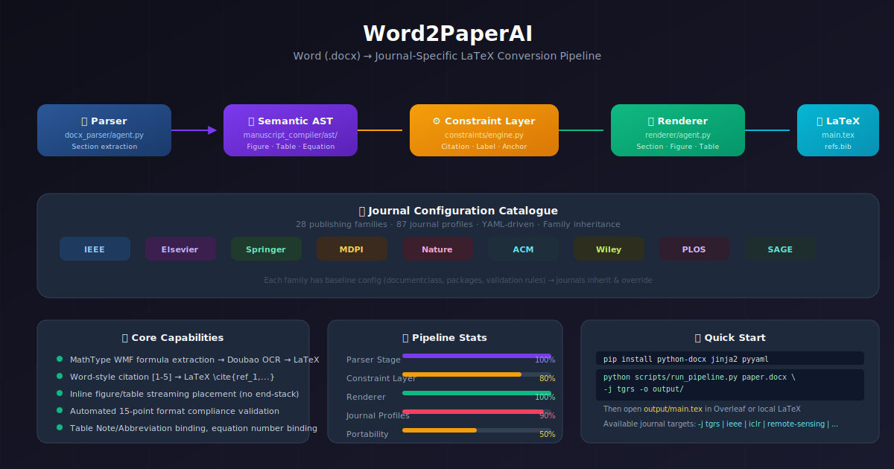

<p align="center">
  
</p>

<div align="center">

[](README.md)
[](README.zh.md)

</div>

<h1 align="center">Word2PaperAI</h1>
<p align="center">
  <strong>Word (.docx) → Journal-Specific LaTeX Converter</strong>
</p>

<p align="center">
  <em>Convert your Word manuscripts into publication-ready LaTeX projects — with equation recognition, citation management, figure/table anchoring, and automatic journal formatting.</em>
</p>

<p align="center">
  
  
  
  
</p>

---

> **🇨🇳 中文版请见 [README.zh.md](README.zh.md)**

---

## 📋 Overview

Word2PaperAI takes a Word manuscript (`.docx`) and transforms it into a journal-compliant LaTeX project. It handles:

- **Structure extraction** — Sections, headings, paragraphs, lists
- **Math formula recognition** — MathType/WMF formulas via Doubao Vision API → LaTeX
- **Image/table extraction** — TIFF→PNG conversion, caption detection, table note binding
- **Citation conversion** — Word-style `[1-5]` → LaTeX `\cite{...}` → real BibTeX keys via Semantic Scholar
- **Figure/table anchoring** — Streaming placement at first reference paragraph
- **Journal formatting** — 115 journal profiles (28 publishing families) drive document class, packages, placement, caption style, and validation rules

### Three-Layer Architecture

```
📄 Word .docx
   ↓ Parser (deterministic) — extracts sections, figures, tables, equations, references
📊 Semantic AST
   ↓ Constraint Layer — citation conversion, label generation, anchor injection, formatting rules
📝 Constrained AST
   ↓ Renderer — pure LaTeX output, no formatting logic
📦 LaTeX Project (main.tex + refs.bib + figures/)
```

---

## ✨ Features

### Content Extraction
| Capability | Status |
|------------|--------|
| Section tree with heading hierarchy | ✅ Complete |
| Figure extraction + caption binding | ✅ Complete |
| Table extraction + caption/note binding | ✅ Complete |
| MathType WMF formula extraction | ✅ Complete |
| Formula LaTeX recognition (Doubao Vision API) | ✅ Complete |
| Bibliography reference extraction | ✅ Complete |

### Formatting & Conversion
| Capability | Status |
|------------|--------|
| Citation: `[1-5]` → `\cite{ref_1,...}` | ✅ Complete |
| Figure/Table reference: `Fig. 3` → `Fig.~\ref{fig:3}` | ✅ Complete |
| En-dash/em-dash citation compatibility | ✅ Complete |
| Inline figure/table streaming placement | ✅ Complete |
| Equation inline/display auto-classification (semantic rules) | ✅ Complete |
| Equation number binding `(1)(2)` → parent display equation | ✅ Complete |
| Table Note/Abbreviation binding | ✅ Complete |
| IEEEtran double-column auto-classification | ✅ Complete |

### Bibliography
| Capability | Status |
|------------|--------|
| Semantic Scholar DOI search | ✅ Complete |
| Crossref BibTeX retrieval | ✅ Complete |
| Deduplication of BibTeX keys | ✅ Complete |
| `\bibliography{refs}` with `\nocite{*}` | ✅ Complete |
| Manual fixes for YOLOv3, MMDetection, KFIoU | ✅ Complete |

### Journal Profiles
| Capability | Status |
|------------|--------|
| Profile-driven documentclass/packages | ✅ 115 journals |
| Family inheritance (IEEE → TGRS → sub-journals) | ✅ 28 families |
| Float placement policy (near-reference, strict-stream, top-preferred) | ✅ Configurable |
| Caption position policy (below/above) | ✅ Configurable |
| Section numbering (arabic/none) | ✅ Configurable |
| Format compliance validation (15 checks) | ⚠️ IEEE-specific |
| **Cross-journal portability** | ⚠️ Needs refactoring |

---

## 🚀 Quick Start

### Installation

```bash
pip install python-docx jinja2 pyyaml
```

### Run the Pipeline

```bash
# Basic usage
python scripts/run_pipeline.py your_paper.docx -j tgrs -o output/

# Available journals
python scripts/run_pipeline.py your_paper.docx -j ieee       # IEEE family
python scripts/run_pipeline.py your_paper.docx -j tgrs       # IEEE TGRS
python scripts/run_pipeline.py your_paper.docx -j iclr       # ICLR
python scripts/run_pipeline.py your_paper.docx -j remote-sensing  # MDPI Remote Sensing
```

The pipeline:
1. Parses the docx into a Semantic AST
2. Injects formula LaTeX (via image recognition cache)
3. Applies journal formatting constraints
4. Renders LaTeX with streaming figure/table placement
5. Copies official template files (document class, bibliography style, etc.)

### Apply BibTeX References

```bash
python manuscript_compiler/scripts/apply_bib.py output/
```

This extracts full reference texts from the original docx, searches Semantic Scholar, generates `refs.bib`, and replaces `\cite{ref_N}` with real BibTeX keys.

---

## 📁 Project Structure

```
Word2PaperAI/
├── scripts/
│   └── run_pipeline.py              # CLI entry point
├── manuscript_compiler/
│   ├── ast/                         # Semantic AST data models
│   │   ├── manuscript.py            # Manuscript root node
│   │   ├── section.py               # Section, Paragraph, TextRun
│   │   ├── figure.py                # Figure node
│   │   ├── table.py                 # Table node
│   │   ├── equation.py              # Equation node
│   │   └── citation.py              # Citation node
│   ├── agents/
│   │   ├── docx_parser/             # Parser — docx → AST
│   │   │   ├── agent.py             # Pipeline orchestrator
│   │   │   ├── ooxml_extractor.py   # Section structure extraction
│   │   │   ├── image_extractor.py   # Figure/image extraction
│   │   │   ├── table_extractor.py   # Table extraction
│   │   │   ├── equation_extractor.py# MathType formula extraction (lxml)
│   │   │   ├── wmf_converter.py     # WMF → PNG conversion
│   │   │   └── formula_recognizer.py# Doubao Vision API for formula OCR
│   │   └── renderer/                # Renderer — constrained AST → LaTeX
│   │       ├── agent.py             # Main renderer orchestrator
│   │       ├── section_renderer.py  # Section/paragraph LaTeX
│   │       ├── figure_renderer.py   # Figure LaTeX
│   │       ├── table_renderer.py    # Table LaTeX
│   │       ├── equation_renderer.py # Equation LaTeX
│   │       └── bib_renderer.py      # Bibliography rendering
│   ├── constraints/
│   │   └── engine.py                # Constraint Layer — formatting rules
│   ├── journal_profiles/            # Journal configuration
│   │   ├── models.py                # JournalProfile dataclass
│   │   ├── registry.py              # Profile registry (catalog + builtin)
│   │   └── catalog/                 # 115 journal YAML profiles
│   │       ├── families/            # 28 publishing families
│   │       └── journals/            # 87 individual journals
│   ├── pipelines/
│   │   └── full_pipeline.py         # Pipeline orchestrator
│   └── scripts/
│       ├── apply_bib.py             # BibTeX search & application
│       ├── crossref_bib.py          # Crossref API batch search
│       └── validate_output.py       # Format compliance validation
├── templates/                       # Official journal LaTeX templates
│   ├── ieee/                        # IEEEtran templates
│   └── tgrs/                        # IEEE TGRS templates
├── config/                          # Pipeline configuration YAML
├── tests/                           # Test outputs
└── docs/
    └── architecture.svg             # Architecture diagram
```

---

## 📚 Journal Support

Word2PaperAI includes 115 journal profiles organized by 28 publishing families:

| Family | # Journals | Status |
|--------|-----------|--------|
| **IEEE** | 20 (TGRS, TPAMI, TNNLS, etc.) | ✅ Active |
| **Elsevier** | 14 (Pattern Recognition, etc.) | ✅ Config loaded |
| **Springer** | 7 (Neural Computing, etc.) | ✅ Config loaded |
| **MDPI** | 6 (Remote Sensing, Sensors) | ✅ Config loaded |
| **Nature Portfolio** | 3 (Nature, Nature Comms, Sci Rep) | ✅ Config loaded |
| **ACM** | 2 (Computing Surveys, TOG) | ✅ Config loaded |
| **Wiley** | 3 | ✅ Config loaded |
| **PLOS** | 1 (PLOS ONE) | ✅ Config loaded |
| **Frontiers** | 3 | ✅ Config loaded |
| Others | 20+ families | ✅ Config loaded |

The **Constraint Layer architecture** decouples journal-specific formatting rules from the renderer, making it configurable via YAML profiles. However, the IEEE-specific title block (`\IEEEauthorblockN`, `\begin{IEEEkeywords}`, etc.) is still hardcoded — refactoring for true journal-agnostic rendering is in progress.

---

## 🔧 Known Limitations

- **Equation position**: Equations are placed at the end of their containing paragraph (placeholder `\x00EQ\x00` is appended, not inserted at the exact document position). Full inline paragraph insertion is tracked as a TODO.
- **Cross-journal portability**: The title block (`_render_ieee_title_block`) is IEEE-specific. Switching to Elsevier/Springer/Nature requires a generic title block system.
- **Formula recognition**: Requires Doubao Vision API (WMF→PNG→OCR). Falls back gracefully to image placeholders if the API is unavailable.
- **Overleaf compilation**: The output has been thoroughly tested with `IEEEtran.cls`. pdflatex dependency is required.

---

## 🤝 Contributing

This project is under active development. Contributions, issue reports, and feature requests are welcome.

### Development Plan

```
Phase 1: Parser + Renderer + TGRS profile  ✅ Complete
Phase 2: Multi-journal Constraint Layer      ✅ Complete (80%)
Phase 3: Cross-journal portability           🔄 In Progress
Phase 4: Self-healing compilation pipeline   📋 Planned
```

---

## 📄 License

MIT License — see LICENSE file for details.

---

<p align="center">
  <sub>Built with ❤️ for researchers tired of manual Word → LaTeX conversion</sub>
</p>
