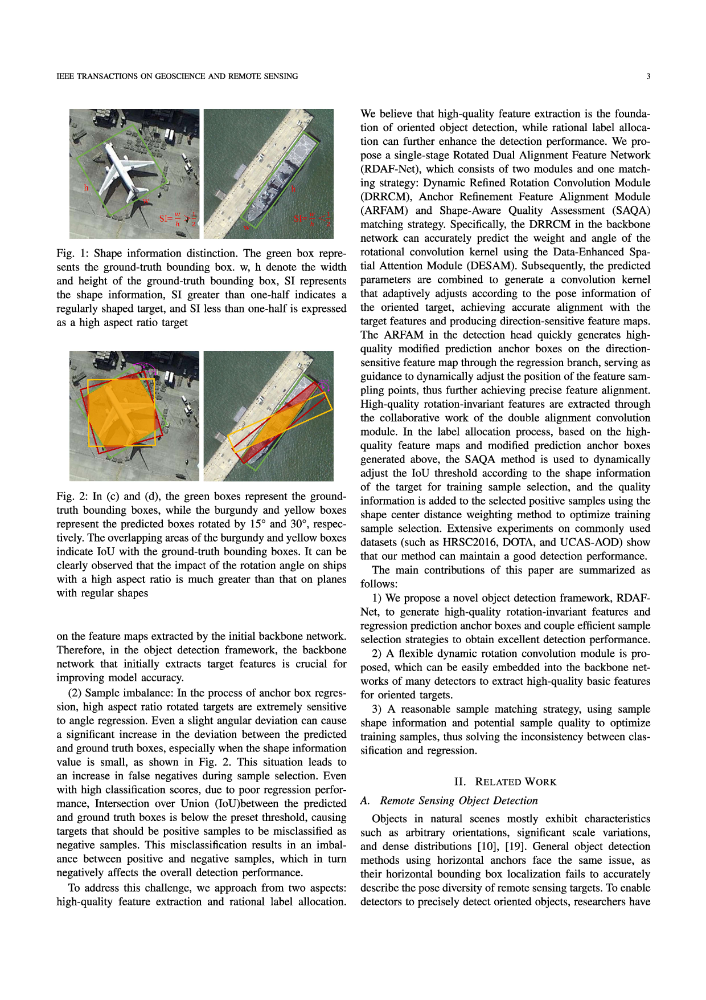
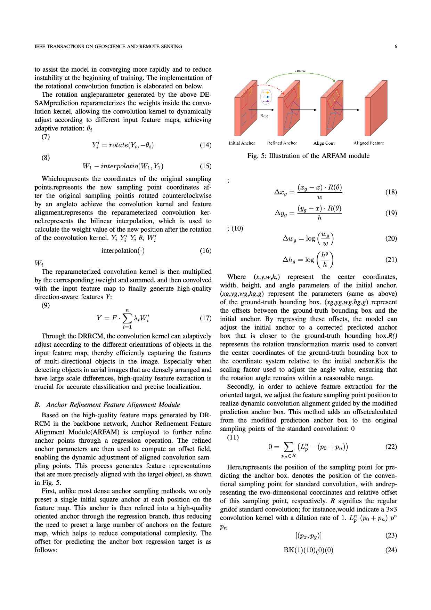
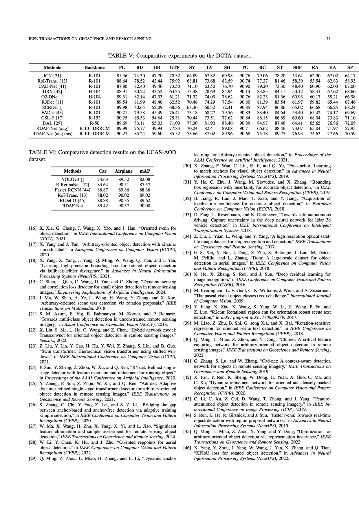

<p align="center">
  
</p>

<p align="center">
  <em>✅ 当前优势 — 可预览，输出质量高</em>
</p>

<br>

<p align="center">
  
</p>

<p align="center">
  <em>⚠️ 待优化 — 公式识别仍有改进空间</em>
</p>

<br>

<p align="center">
  
</p>

<p align="center">
  <em>⚠️ 待优化 — 表格自适应布局需优化</em>
</p>

<br>

<div align="center">

[](README.md)
[](README.zh.md)

</div>

<h1 align="center">Word2LaTeX</h1>
<p align="center">
  <strong>Word (.docx) → 期刊投稿专用 LaTeX 转换器</strong>
</p>

<p align="center">
  <em>将你的 Word 投稿论文一键转换为符合期刊格式的 LaTeX 项目 —— 支持公式识别、引用管理、图表锚定和自动期刊格式化。</em>
</p>

<p align="center">
  
  
  
  
</p>

---

> **🇬🇧 English version at [README.md](README.md)**

---

## 📋 项目概述

Word2LaTeX 将 Word 投稿稿件（`.docx`）自动转换为符合目标期刊格式的 LaTeX 项目。主要功能包括：

- **结构提取** — 章节、标题、段落、列表
- **数学公式识别** — MathType/WMF 公式通过豆包 Vision API 转为 LaTeX
- **图片/表格提取** — TIFF→PNG 转换、图题检测、表注绑定
- **引用转换** — Word 格式 `[1-5]` → LaTeX `\cite{...}` → 通过 Semantic Scholar 获取真实 BibTeX 键
- **图/表锚定** — 在首次引用段落处流式插入，告别文末堆叠
- **期刊格式化** — 115 种期刊配置（28 个出版家族）驱动文档类、宏包、图表位置、图题样式和校验规则

### 三层架构

```
📄 Word .docx
   ↓ Parser（确定性解析）— 提取章节、图片、表格、公式、参考文献
📊 语义 AST
   ↓ Constraint Layer（约束层）— 引用转换、标签生成、锚定注入、格式规则
📝 约束后的 AST
   ↓ Renderer（渲染器）— 纯 LaTeX 输出，不含格式逻辑
📦 LaTeX 项目（main.tex + refs.bib + figures/）
```

**Renderer 绝不包含任何格式决策逻辑。** 所有格式规则由 Constraint Layer 注入，Renderer 只管输出 LaTeX 环境。这是实现多期刊支持的核心设计。

---

## ✨ 功能清单

| 类别 | 能力 |
|------|------|
| **内容提取** | 章节、标题、图片、表格、公式（MathType WMF）、参考文献 |
| **公式识别** | WMF → 豆包 Vision API → LaTeX，inline/display 自动分类 |
| **引用管理** | `[1-5]` → `\cite{...}` → 通过 Semantic Scholar/Crossref 获取真实 BibTeX 键 |
| **图/表放置** | 首次引用段落处流式插入，告别文末堆叠 |
| **期刊格式化** | 115 种期刊配置（28 个家族）— 文档类、宏包、图题位置、校验规则 |
| **交叉引用** | "Fig. 3" → `Fig.~\ref{fig:3}`，"Table 1" → `Table~\ref{tab:1}` 自动转换 |

---

## 🚀 快速开始

### 安装依赖

```bash
pip install python-docx jinja2 pyyaml
```

### 运行转换管线

```bash
# 基本用法
python scripts/run_pipeline.py 你的论文.docx -j tgrs -o output/

# 可用期刊目标
python scripts/run_pipeline.py 你的论文.docx -j ieee       # IEEE 系列
python scripts/run_pipeline.py 你的论文.docx -j tgrs       # IEEE TGRS
python scripts/run_pipeline.py 你的论文.docx -j iclr       # ICLR
python scripts/run_pipeline.py 你的论文.docx -j remote-sensing  # MDPI Remote Sensing
```

管线执行流程：
1. 将 docx 解析为语义 AST
2. 注入公式 LaTeX（通过图片识别缓存）
3. 应用期刊格式约束
4. 渲染 LaTeX（图/表流式插入）
5. 复制官方模板文件（文档类、参考文献样式等）

### 应用 BibTeX 参考文献

```bash
python manuscript_compiler/scripts/apply_bib.py output/
```

此脚本从原始 docx 提取完整参考文献文本，通过 Semantic Scholar 搜索 DOI，生成 `refs.bib`，并将 `\cite{ref_N}` 替换为真实 BibTeX 键。

---

## 📁 项目结构

```
Word2LaTeX/
├── scripts/
│   └── run_pipeline.py              # 命令行入口
├── manuscript_compiler/
│   ├── ast/                         # 语义 AST 数据模型
│   │   ├── manuscript.py            # 稿件根节点
│   │   ├── section.py               # 章节、段落、文本段
│   │   ├── figure.py                # 图片节点
│   │   ├── table.py                 # 表格节点
│   │   ├── equation.py              # 公式节点
│   │   └── citation.py              # 引用节点
│   ├── agents/
│   │   ├── docx_parser/             # 解析器 — docx → AST
│   │   │   ├── agent.py             # 管线编排
│   │   │   ├── ooxml_extractor.py   # 章节结构提取
│   │   │   ├── image_extractor.py   # 图片提取
│   │   │   ├── table_extractor.py   # 表格提取
│   │   │   ├── equation_extractor.py# MathType 公式提取（lxml）
│   │   │   ├── wmf_converter.py     # WMF → PNG 转换
│   │   │   └── formula_recognizer.py# 豆包 Vision API 公式 OCR
│   │   └── renderer/                # 渲染器 — 约束 AST → LaTeX
│   │       ├── agent.py             # 主渲染编排
│   │       ├── section_renderer.py  # 章节/段落 LaTeX
│   │       ├── figure_renderer.py   # 图片 LaTeX
│   │       ├── table_renderer.py    # 表格 LaTeX
│   │       ├── equation_renderer.py # 公式 LaTeX
│   │       └── bib_renderer.py      # 参考文献渲染
│   ├── constraints/
│   │   └── engine.py                # 约束层 — 格式规则引擎
│   ├── journal_profiles/            # 期刊配置
│   │   ├── models.py                # JournalProfile 数据类
│   │   ├── registry.py              # 配置注册表（catalog + 内置）
│   │   └── catalog/                 # 115 种期刊 YAML 配置
│   │       ├── families/            # 28 个出版家族
│   │       └── journals/            # 87 种具体期刊
│   ├── pipelines/
│   │   └── full_pipeline.py         # 管线编排器
│   └── scripts/
│       ├── apply_bib.py             # BibTeX 搜索与应用
│       ├── crossref_bib.py          # Crossref API 批量搜索
│       └── validate_output.py       # 格式合规校验
├── templates/                       # 官方期刊 LaTeX 模板
│   ├── ieee/                        # IEEEtran 模板
│   └── tgrs/                        # IEEE TGRS 模板
├── config/                          # 管线配置 YAML
└── docs/
    └── architecture.svg             # 架构图
```

---

## 📚 期刊支持

Word2LaTeX 包含 115 种期刊配置，按 28 个出版家族组织：

| 出版家族 | 期刊数 | 状态 |
|---------|--------|------|
| **IEEE** | 20（TGRS、TPAMI、TNNLS 等） | ✅ 活跃使用 |
| **Elsevier** | 14（Pattern Recognition 等） | ✅ 配置已加载 |
| **Springer** | 7（Neural Computing 等） | ✅ 配置已加载 |
| **MDPI** | 6（Remote Sensing、Sensors） | ✅ 配置已加载 |
| **Nature Portfolio** | 3（Nature、Nature Comms、Sci Rep） | ✅ 配置已加载 |
| **ACM** | 2（Computing Surveys、TOG） | ✅ 配置已加载 |
| **Wiley** | 3 | ✅ 配置已加载 |
| **PLOS** | 1（PLOS ONE） | ✅ 配置已加载 |
| **Frontiers** | 3 | ✅ 配置已加载 |
| 其他 | 20+ 家族 | ✅ 配置已加载 |

**约束层架构**将期刊格式规则与渲染器解耦，支持通过 YAML 配置驱动。但目前 IEEE 特化的标题块（`\IEEEauthorblockN`、`\begin{IEEEkeywords}` 等）仍为硬编码，多期刊通用的渲染系统正在建设中。

---

## 🔧 已知限制

- **公式位置**：公式当前放置在所在段落的末尾（占位符 `\x00EQ\x00` 追加到段尾，而非精确插入到文档原始位置）。精确的段内插入有待实现。
- **跨期刊可移植性**：标题块渲染（`_render_ieee_title_block`）为 IEEE 专用。切换到 Elsevier/Springer/Nature 需要通用的标题块系统。
- **公式识别**：需要豆包 Vision API（WMF→PNG→OCR）。当 API 不可用时，会优雅地回退到图片占位符。
- **Overleaf 编译**：输出已通过 `IEEEtran.cls` 大量测试。需要 pdflatex 环境。

---

## 🤝 贡献

本项目处于积极开发阶段。欢迎贡献代码、提交 issue 或提出功能建议。

### 开发路线图

```
第一阶段：解析器 + 渲染器 + TGRS 配置  ✅ 已完成
第二阶段：多期刊约束层                  ✅ 已完成（80%）
第三阶段：跨期刊可移植性                🔄 进行中
第四阶段：自愈编译管线                  📋 规划中
```

---

## 📄 协议

MIT License — 详见 LICENSE 文件。

---

## 🙏 致谢

我们的 LaTeX 期刊配置系统（28 个出版家族、115+ 种期刊配置）参考了 [**JournalManuscript**](https://github.com/amine123max/JournalManuscript) 项目（作者：amine123max）的优秀设计。我们尊重原作者的工作，感谢他们对学术出版社区的贡献。

---

<p align="center">
  <sub>💪 为厌烦手动 Word → LaTeX 转换的科研人员打造</sub>
</p>
